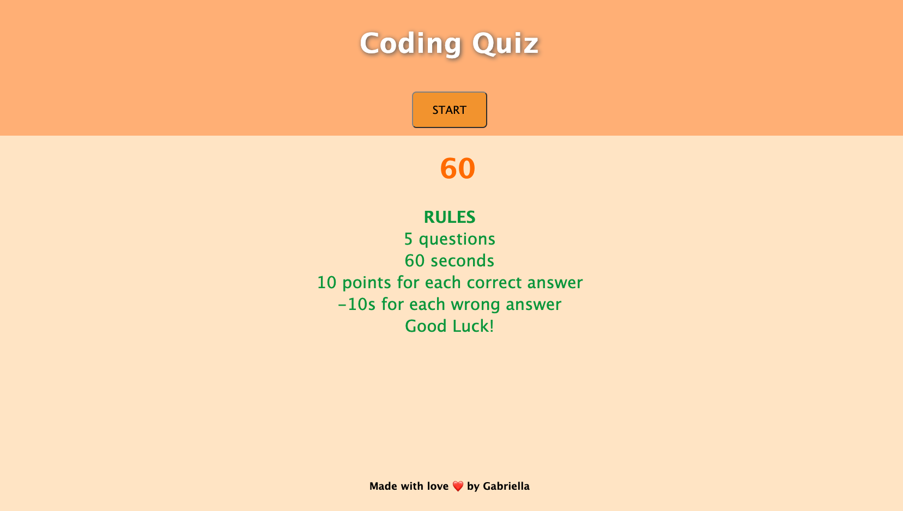

# Coding Quiz

## Description

This coding quiz is a timed quiz where you have 60 seconds to answer 5 questions. For each correct question question you will earn 10 points and for each wrong question 10s will be deduct from your remaining time.

## Installation

No installation needed. 

## Usage

Press the "Start" button to start the quiz.

Once the quiz has begun, you will have 60 seconds to answer all of the questions. When you finish or your timer reaches 0 seconds, the quiz will be automatically ended and you will have to type in your initials and click on the submit button to check your score.

## Credits

GABRIELLA - https://github.com/puentedg/coding-quiz

